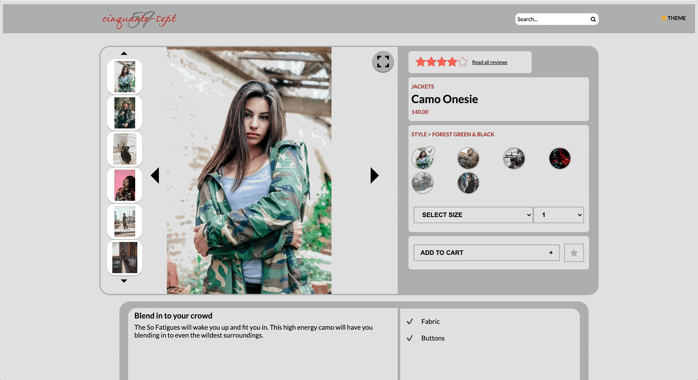

# Project Atelier

#### An e-commerce demo application

## Technologies Used
 * React
 * Express
 * Node
 * CSS
 * JavaScript

## Description

This e-commerce website demo allows users to view products and scroll through related products. Users can also submit questions and reviews which also have additional sorting capabilities. Users can also view the website in light or darkmode. 

## Setup/Installation

- Clone this repo to your desktop
- Use command `npm install` to install all necessary packages
- Use command `npm run start` to start the server
- Use command `npm run build` to compile code
- Open `index.html` in your browser

## Usage

[localhost:1234](localhost:1234)

## Contributing

Pull requests are welcome. For major changes, please open an issue first to discuss what you would like to change.

Please make sure to update tests as appropriate.

## Credit

- Overview: [Adam Lohnes](https://github.com/adam-lohnes)
- Header & Related Product: [Yitong Liu](https://github.com/lyt414)
- Questions & Answers: [Yuanqi Wang](https://github.com/yuanqiwang)
- Reviews: [Maggie Saldivia](https://github.com/Maggie-Mango)

## License

